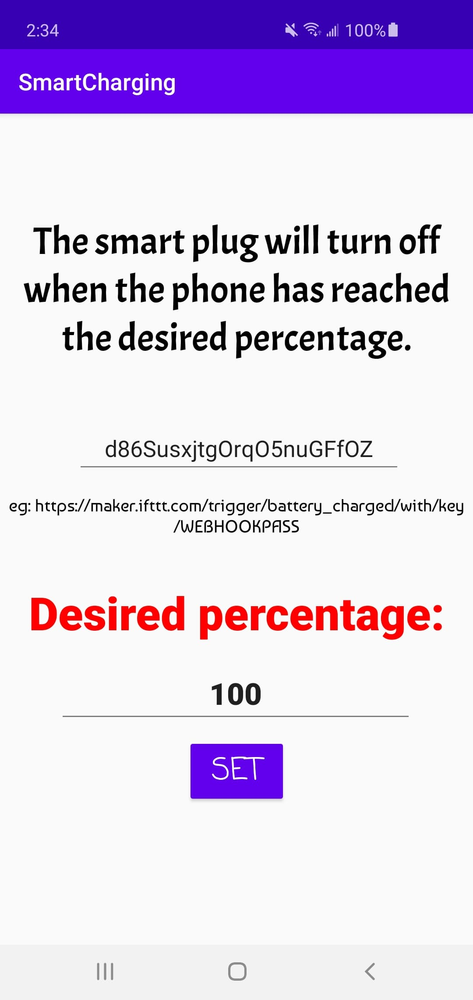
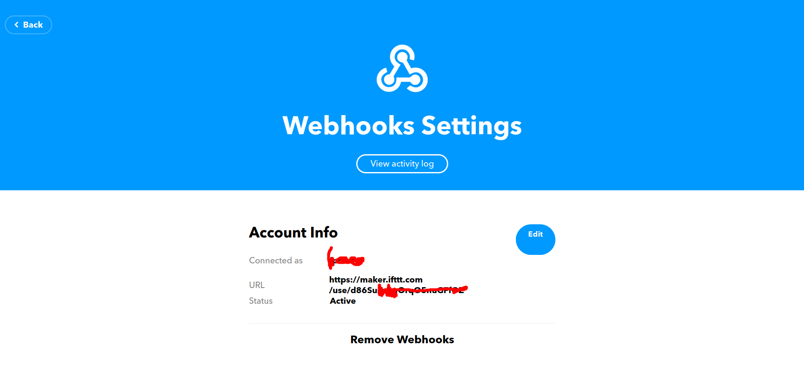

# SmartCharging
APP RUNS IN THE BACKGROUND \
Turns off the Smart Plug when reaches a certain percentage.\

# First Step:
Login into yout ifttt account and search for webhooks services and connect.\
Note down your webhook pass by clicking on the settings. \
You should have something like this: \

# Second Step:
Create a new applet and add webhooks

# Third Step:
Then + \
search for the app that connects to your smart plug and connect

# Done
Now everytime you send a request to https://maker.ifttt.com/use/webhookpass, it triggers the action which is turning off the smart plug.

# Now open up the smartcharhing app
Paste the webhookpass in the space provided and set the battery percentage.

# CLICK on the SET button
